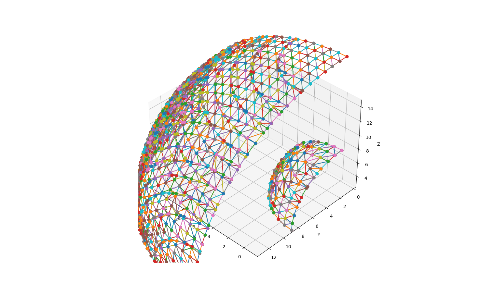
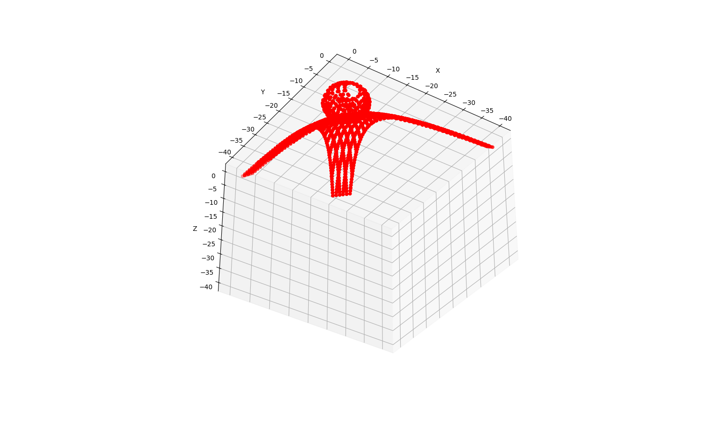
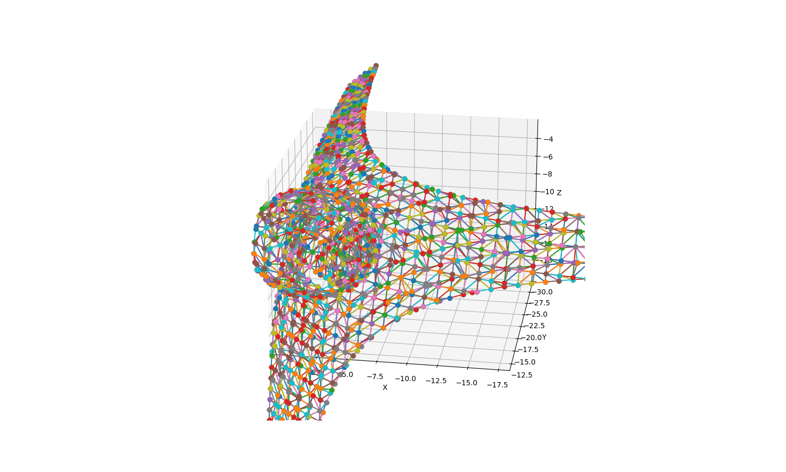
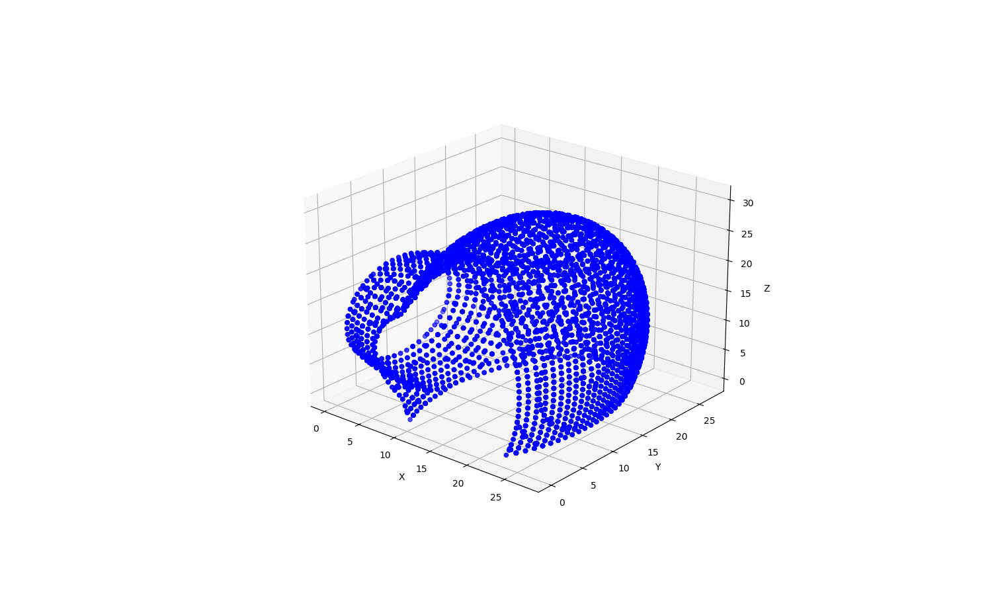
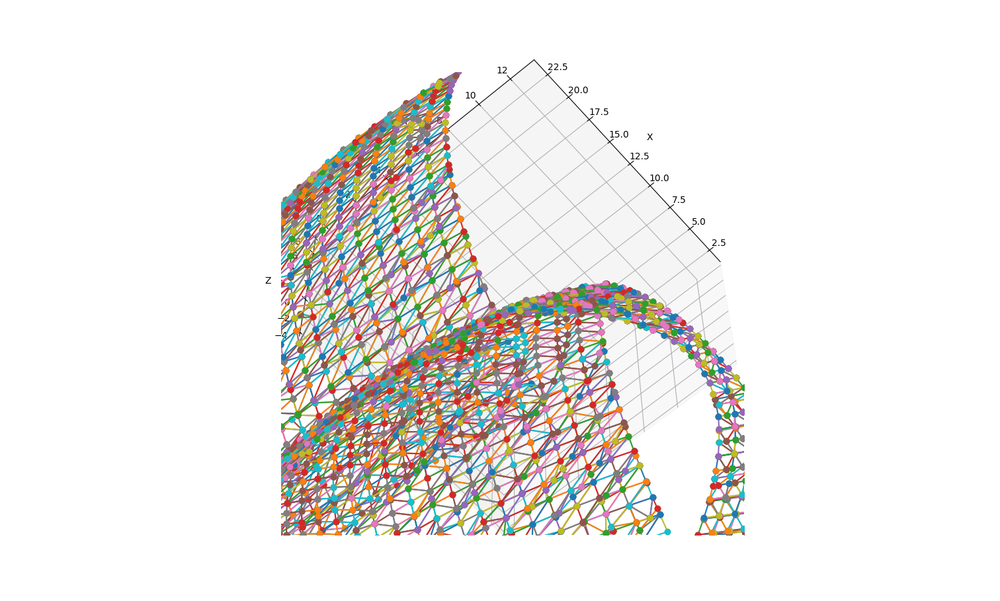

# Mesh Generation Library implementation in C++ 
In this project, we plan to implement mesh generation algorithms for 2D and 3D shapes in C++.

## Algorithm
 - Marching Cubes

**compilation and execution [in src]**
 ```
   g++ -std=c++14 -o marchingcubes marchingcubes.cpp
   ./marchingcubes
 ```
 **visualization[in test/]**
 ```
 python3 viz.py
 ```

## Test results










## Future plans
- add support for multi-threading 
- OpenCL / CUDA-based functions 
- addition of better interpolation functions
- support for  IO (.ply, .obj, .mesh )


**contributors**
- PJ Avinash
- Akhila Petnikota
**contact-email**
- petnikotaakhila@gmail.com
- avinashindian2.0@gmail.com
